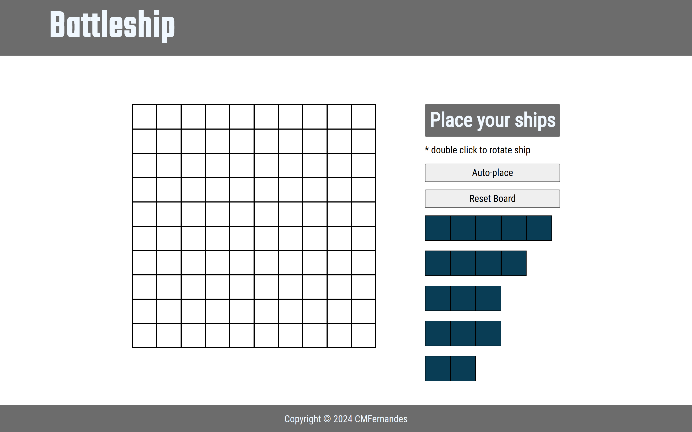

# battleship

:point_right: [live demo](https://cmfernandes.github.io/battleship/) 

---

## About

This project is a battleship game where the player plays against an AI wich will randomly attack.

The main purpose of this project was to practice:
- Test Driven Development

Assigment from [The Odin Project](https://www.theodinproject.com/lessons/node-path-javascript-battleship) Javascript course. 